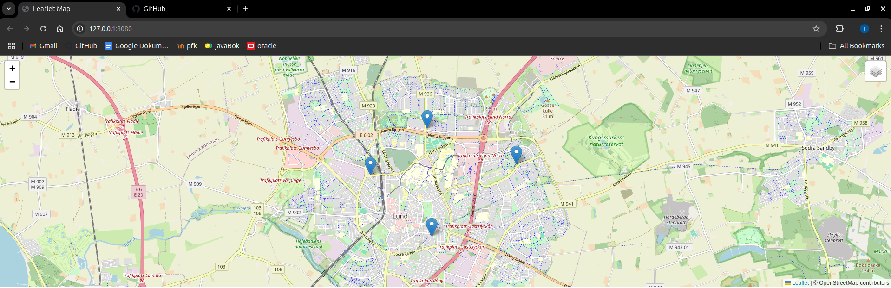

# map
Tried out Leaflet. works super well. I Don't have a use for it as of right now, bt perhaps in the future. This is a template for said future. Feel free to copy.

Added so that the user can swap between different map layers and put down pins, which are stored in an array (May be useful to send to the backend to check if something is wihing hte marked area).

